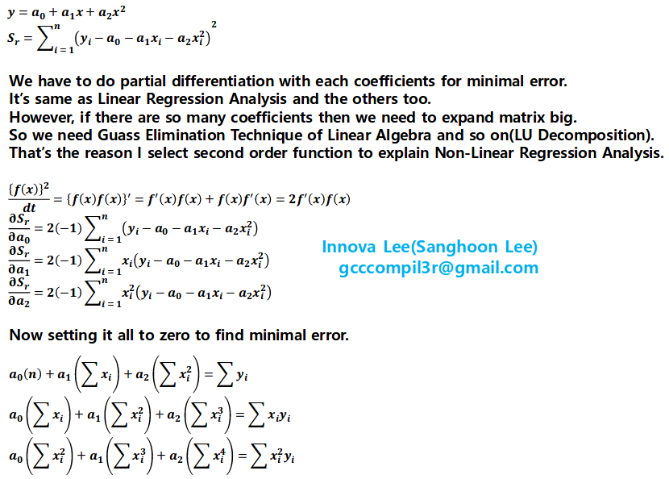
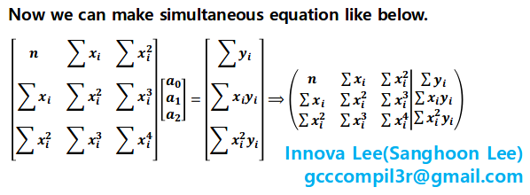
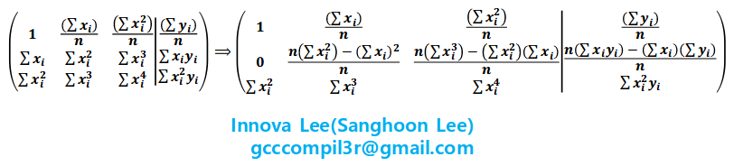
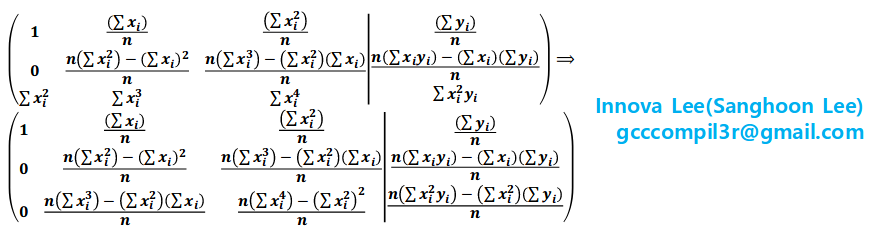
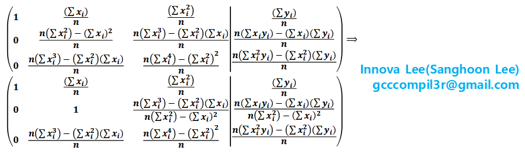
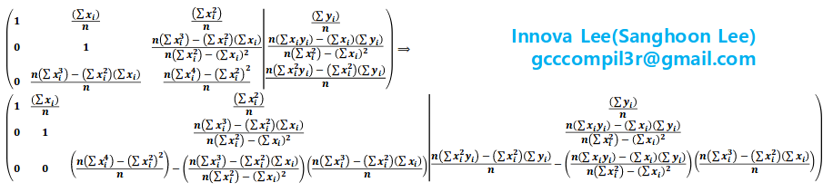
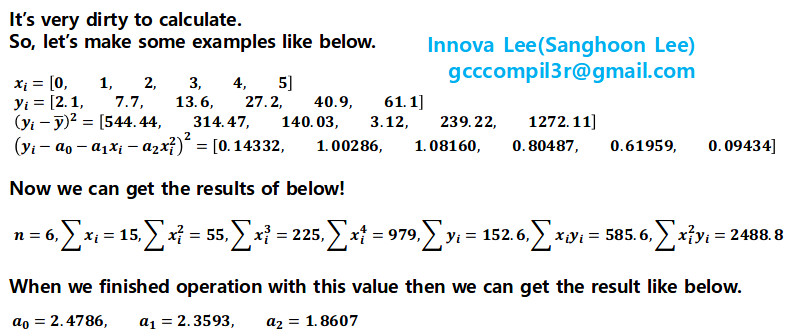
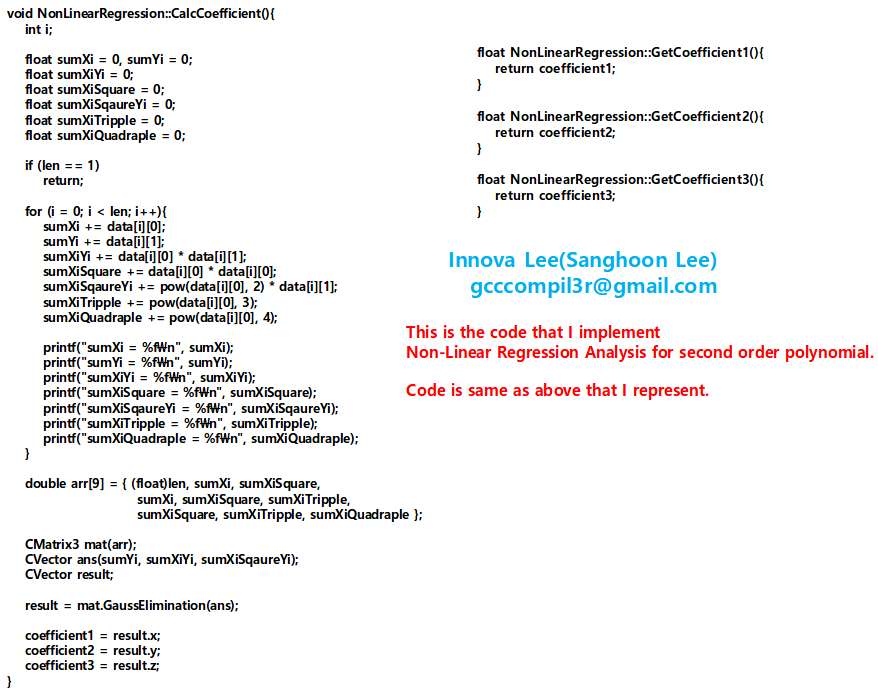
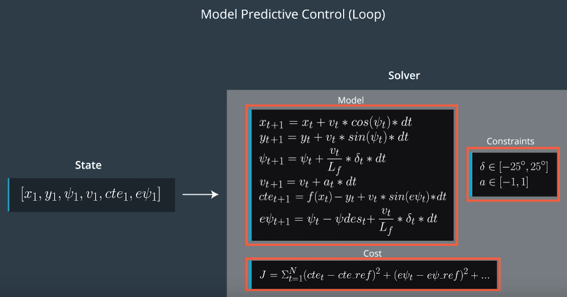

# CarND-Controls-MPC
Self-Driving Car Engineer Nanodegree Program

---

## Dependencies

* cmake >= 3.5
 * All OSes: [click here for installation instructions](https://cmake.org/install/)
* make >= 4.1(mac, linux), 3.81(Windows)
  * Linux: make is installed by default on most Linux distros
  * Mac: [install Xcode command line tools to get make](https://developer.apple.com/xcode/features/)
  * Windows: [Click here for installation instructions](http://gnuwin32.sourceforge.net/packages/make.htm)
* gcc/g++ >= 5.4
  * Linux: gcc / g++ is installed by default on most Linux distros
  * Mac: same deal as make - [install Xcode command line tools]((https://developer.apple.com/xcode/features/)
  * Windows: recommend using [MinGW](http://www.mingw.org/)
* [uWebSockets](https://github.com/uWebSockets/uWebSockets)
  * Run either `install-mac.sh` or `install-ubuntu.sh`.
  * If you install from source, checkout to commit `e94b6e1`, i.e.
    ```
    git clone https://github.com/uWebSockets/uWebSockets
    cd uWebSockets
    git checkout e94b6e1
    ```
    Some function signatures have changed in v0.14.x. See [this PR](https://github.com/udacity/CarND-MPC-Project/pull/3) for more details.

* **Ipopt and CppAD:** Please refer to [this document](https://github.com/udacity/CarND-MPC-Project/blob/master/install_Ipopt_CppAD.md) for installation instructions.
* [Eigen](http://eigen.tuxfamily.org/index.php?title=Main_Page). This is already part of the repo so you shouldn't have to worry about it.
* Simulator. You can download these from the [releases tab](https://github.com/udacity/self-driving-car-sim/releases).
* Not a dependency but read the [DATA.md](./DATA.md) for a description of the data sent back from the simulator.


## Basic Build Instructions

1. Clone this repo.
2. Make a build directory: `mkdir build && cd build`
3. Compile: `cmake .. && make`
4. Run it: `./mpc`.

## Tips

1. It's recommended to test the MPC on basic examples to see if your implementation behaves as desired. One possible example
is the vehicle starting offset of a straight line (reference). If the MPC implementation is correct, after some number of timesteps
(not too many) it should find and track the reference line.
2. The `lake_track_waypoints.csv` file has the waypoints of the lake track. You could use this to fit polynomials and points and see of how well your model tracks curve. NOTE: This file might be not completely in sync with the simulator so your solution should NOT depend on it.
3. For visualization this C++ [matplotlib wrapper](https://github.com/lava/matplotlib-cpp) could be helpful.)
4.  Tips for setting up your environment are available [here](https://classroom.udacity.com/nanodegrees/nd013/parts/40f38239-66b6-46ec-ae68-03afd8a601c8/modules/0949fca6-b379-42af-a919-ee50aa304e6a/lessons/f758c44c-5e40-4e01-93b5-1a82aa4e044f/concepts/23d376c7-0195-4276-bdf0-e02f1f3c665d)
5. **VM Latency:** Some students have reported differences in behavior using VM's ostensibly a result of latency.  Please let us know if issues arise as a result of a VM environment.

## Editor Settings

We've purposefully kept editor configuration files out of this repo in order to
keep it as simple and environment agnostic as possible. However, we recommend
using the following settings:

* indent using spaces
* set tab width to 2 spaces (keeps the matrices in source code aligned)

## Code Style

Please (do your best to) stick to [Google's C++ style guide](https://google.github.io/styleguide/cppguide.html).

## Project Instructions and Rubric

Note: regardless of the changes you make, your project must be buildable using
cmake and make!

More information is only accessible by people who are already enrolled in Term 2
of CarND. If you are enrolled, see [the project page](https://classroom.udacity.com/nanodegrees/nd013/parts/40f38239-66b6-46ec-ae68-03afd8a601c8/modules/f1820894-8322-4bb3-81aa-b26b3c6dcbaf/lessons/b1ff3be0-c904-438e-aad3-2b5379f0e0c3/concepts/1a2255a0-e23c-44cf-8d41-39b8a3c8264a)
for instructions and the project rubric.

## Polynomial Fitting and MPC Preprocessing

I implement this with provided code(polyfit).  
However I wanna understand about curve fitting mechanism.  
So I study it and arrange the concept to implement Non-Linear Regression Analysis about 2-nd order polynomial.  
When we implement polynomial fitting then we need to understand Partial Differentiative, Least Square Estimation, and Linear Algebra.  
First we think about below 2-nd order polynomial.










## Model

The kinematic Model is important to control vehicle around the track.  
We need to ignore Tire Forces, Gravity, and Mass for avoid complexity.  

### States

x = x position of car  
y = y position of car  
Ψ = vehicle's angle from x direction (radian)  
v = velocity of vehicle  
cte = cross track error  
eΨ = orientation error  

### Actuator Values

δ = steering angle  
a = acceleration  

### Update Equations

Update equation works like below.  



## Timestep & Elapsed Time

N = 20  

I tested this value with 10, 15, 25, 33, 77, 100.  
However I think 20 is also good.  

dt = 0.1  

I tested this value with 0.05, 0.2.  
I think 0.1 is also good.  

I can see very interesting situation.  
Prediction Horizon is very important to MPC.  
We know this is T = N * dt.  
If we make N so big then it's performance is not so good.  
I think this is same as people.  
If someone have so many working task then perhaps go away.  

Most important mechanism is solver.  
It finds the optimal value to we use.  
I wanna understand it.  
So I explore about this and I know about Optimal Design and Linear Programming.  
However I can't understand it perfectly at this time.  
Anyway this solver give us best steering and acceleration.  

## Model Predictive Control with Latency

If we use real car, there are many mechanical systems and electric systems.  
Electric system almost have no delay.  
However mechanical system has big delay.  
So that makes some latency.  
And I setting it to 100 ms (0.1 s).  

Latency is handled by using above equations to predict the states for after 0.1 s.  
I use dt = 0.1 at main.cpp to control it.  

## References

1. Udacity Lesson(MPC)  
2. Applied Numerical Methos with MATLAB for Engineers and Scientists 3rd Edition, Steven C. Chapra.  
